# Polyglot Codebase Knowledge Graph

> Generated offline by **readmenator**. Supports C, C++, Python, Go, Rust, JS/TS, Java, C#, Shell, PHP, Dart, GDScript, Nim, ASM.
> No LLMs. No tokens. Pure static analysis. See more [here](https://github.com/grisuno/ReadMenator)

**Total Files Parsed:** 2 | **Total Symbols Extracted:** 9 | **Total Imports:** 9

## Structural Knowledge Map

```mermaid
graph TD
    classDef mod fill:#1e1e1e,stroke:#ff6666,stroke-width:2px,color:#fff;
    classDef cls fill:#2d2d2d,stroke:#4ec9b0,stroke-width:2px,color:#fff;
    classDef fn fill:#333,stroke:#dcdcaa,stroke-width:1px,color:#dcdcaa;
    classDef ext fill:#111,stroke:#666,stroke-dasharray:5 5,color:#aaa;
    app_py["app.py (py)"]
    class app_py mod;
    app_py_signal_handler["signal_handler"]
    class app_py_signal_handler fn;
    app_py --> app_py_signal_handler
    app_py_check_sudo["check_sudo"]
    class app_py_check_sudo fn;
    app_py --> app_py_check_sudo
    app_py_parse_arguments["parse_arguments"]
    class app_py_parse_arguments fn;
    app_py --> app_py_parse_arguments
    app_py_handle_ftp_client["handle_ftp_client"]
    class app_py_handle_ftp_client fn;
    app_py --> app_py_handle_ftp_client
    app_py_run_fake_ftp["run_fake_ftp"]
    class app_py_run_fake_ftp fn;
    app_py --> app_py_run_fake_ftp
    install_sh["install.sh (sh)"]
    class install_sh mod;
    ext_socket["socket"]
    class ext_socket ext;
    app_py -.->|imports| ext_socket
    ext_threading["threading"]
    class ext_threading ext;
    app_py -.->|imports| ext_threading
    ext_sys["sys"]
    class ext_sys ext;
    app_py -.->|imports| ext_sys
    ext_os["os"]
    class ext_os ext;
    app_py -.->|imports| ext_os
    ext_signal["signal"]
    class ext_signal ext;
    app_py -.->|imports| ext_signal
    ext_argparse["argparse"]
    class ext_argparse ext;
    app_py -.->|imports| ext_argparse
    ext_struct["struct"]
    class ext_struct ext;
    app_py -.->|imports| ext_struct
    ext_time["time"]
    class ext_time ext;
    app_py -.->|imports| ext_time
    ext_re["re"]
    class ext_re ext;
    app_py -.->|imports| ext_re
```

---

## Architecture Reference

### PY (1 files)

#### `app.py`
**Path:** `app.py`

**Functions:**
- `signal_handler` (line 35) `def signal_handler(sig, frame)`
- `check_sudo` (line 41) `def check_sudo()`
- `parse_arguments` (line 49) `def parse_arguments()`
- `handle_ftp_client` (line 72) `def handle_ftp_client(client_sock, addr)`
- `run_fake_ftp` (line 99) `def run_fake_ftp()`
- `parse_ip_header` (line 119) `def parse_ip_header(data)`
- `parse_tcp_header` (line 131) `def parse_tcp_header(data)`
- `sniffer_loop` (line 141) `def sniffer_loop(interface, verbose)`
- `main` (line 196) `def main()`

### SH (1 files)

#### `install.sh`
**Path:** `install.sh`

*No symbols extracted*
