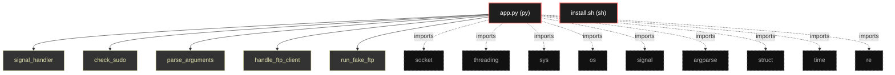

# Polyglot Codebase Knowledge Graph

> Generated offline by **readmenator**. Supports C, C++, Python, Go, Rust, JS/TS, Java, C#, Shell, PHP, Dart, GDScript, Nim, ASM, Ruby, Swift, Kotlin, Scala, Lua, Elixir.
> No LLMs. No tokens. Pure static analysis. See more [here](https://github.com/grisuno/ReadMenator)

**Total Files Parsed:** 2 | **Total Symbols Extracted:** 9 | **Total Imports:** 9

<!-- ranking_model: v1.0 | weights: {ppr:0.45,auth:0.2,test:0.15,doc:0.1,fresh:0.1} | alpha:0.85 | commit:e63a2e6 | date:2026-07-18 -->


## Table of Contents

1. [Statistics Dashboard](#statistics-dashboard)
2. [Architectural Layers](#architectural-layers)
3. [Ranked Context](#ranked-context)
4. [God Nodes](#god-nodes)
5. [Suggested Questions](#suggested-questions)
6. [Hotspot Analysis](#hotspot-analysis)
7. [Change Impact Analysis](#change-impact-analysis)
8. [Suggested Linting Rules](#suggested-linting-rules)
9. [Orphans](#orphans)
10. [Query Recipes](#query-recipes)
11. [Structural Knowledge Map](#structural-knowledge-map)
12. [Code Property Graph](#code-property-graph)
13. [Architecture Reference](#architecture-reference)
    - [PY (1 files)](#py-1-files)
    - [SH (1 files)](#sh-1-files)

---

## Statistics Dashboard

| Metric | Value |
|--------|-------|
| Total Files | 2 |
| Total Symbols | 9 |
| Total Imports | 9 |
| Call Edges | 75 |
| Inheritance Edges | 0 |
| Languages | 2 |
| Avg Symbols/File | 4.5 |
| Avg Imports/File | 4.5 |

### Top Files by Import Count (Fan-Out)

| File | Imports | Symbols | Language |
|------|---------|---------|----------|
| `app.py` | 9 | 9 | py |

---

## Architectural Layers

Auto-detected from path patterns, naming conventions, and imported frameworks.

| Layer | Files |
|-------|-------|
| utility | 2 |

### utility

- `app.py` (py, 9 symbols)
- `install.sh` (sh, 0 symbols)

---

## Ranked Context

Files ranked by composite score for the current query context. The ranking combines Personalized PageRank (query relevance), global authority, test coverage, documentation coverage, and code freshness. Model: v1.0.

| Rank | File | Composite | PPR | Authority | Test | Doc |
|------|------|-----------|-----|-----------|------|-----|
| 1 | `app.py` | 0.0111 | 0.0000 | 0.0000 | 0.00 | 0.11 |
| 2 | `install.sh` | 0.0000 | 0.0000 | 0.0000 | 0.00 | 0.00 |

---

## God Nodes

Most architecturally central files ranked by combined import/export degree and symbol richness.

| File | Score | Connections | PageRank |
|------|-------|-------------|----------|
| `app.py` | 0.9 | | 0.0000 |
| `install.sh` | 0.0 | | 0.0000 |

---

## Suggested Questions

Auto-generated exploration prompts based on graph structure:

- What does app.py depend on, and what depends on it? (0 connections)
- What does install.sh depend on, and what depends on it? (0 connections)
- What is the overall architecture of this codebase?

---

## Hotspot Analysis

Files ranked by combined complexity (symbol count) and centrality (connection count). High-scoring files are architecturally critical and may need refactoring attention.

| File | Complexity | Centrality | Combined | Symbols | Connections |
|------|-----------|------------|----------|---------|-------------|
| `app.py` | 1.000 | 1.000 | 1.000 | 9 | 9 |
| `install.sh` | 0.000 | 0.000 | 0.000 | 0 | 0 |

---

## Change Impact Analysis

Files sorted by how many other files would be affected if they changed. High-impact files should be changed with caution.

| File | Direct Dependents | Transitive Dependents | Total Impact |
|------|------------------|----------------------|--------------|
| `app.py` | 0 | 0 | 0 |
| `install.sh` | 0 | 0 | 0 |

---

## Suggested Linting Rules

Automatically suggested linting and security rules based on patterns detected in the codebase. These can be exported as Semgrep rules using the `--export-rules` flag.

| Rule ID | Severity | Description | Language | Matches |
|---------|----------|-------------|----------|---------|
| `RM001` | info | Large number of functions in py: 9 total | py | 9 |
| `RM002` | info | Print statement found (consider logging instead) | python | 17 |

---

## Orphans

Files with no documentation or low connectivity. These are candidates for documentation investment or cleanup.

- `install.sh` (0 symbols, no doc)

---

## Query Recipes

Example queries you can run against this knowledge base using the ranking engine:

```
# Find files most relevant to a concept
readmenator query "Where is the import resolver implemented?"

# Rank files by relevance to a topic
readmenator query "How does documentation generation work?"

# Explain why a file ranks highly
readmenator query "explain readmenator/_documentation.py"

# Trace dependency paths with ranked context
readmenator query "path from CLI to exporter"
```

The ranking model uses the following signals:

- **Personalized PageRank** (45% weight): query-specific relevance via seed propagation
- **Global Authority** (20% weight): structural importance via standard PageRank
- **Test Coverage** (15% weight): fraction of symbols referenced in test files
- **Doc Coverage** (10% weight): presence of docstrings and file-level docs
- **Freshness** (10% weight): recent modification activity

Results include score decomposition and justification paths for each ranked item.

---

## Structural Knowledge Map


```mermaid
graph TD
    classDef mod fill:#1e1e1e,stroke:#ff6666,stroke-width:2px,color:#fff;
    classDef cls fill:#2d2d2d,stroke:#4ec9b0,stroke-width:2px,color:#fff;
    classDef fn fill:#333,stroke:#dcdcaa,stroke-width:1px,color:#dcdcaa;
    classDef ext fill:#111,stroke:#666,stroke-dasharray:5 5,color:#aaa;
    app_py["app.py (py)"]
    class app_py mod;
    app_py_signal_handler["signal_handler"]
    class app_py_signal_handler fn;
    app_py --> app_py_signal_handler
    app_py_check_sudo["check_sudo"]
    class app_py_check_sudo fn;
    app_py --> app_py_check_sudo
    app_py_parse_arguments["parse_arguments"]
    class app_py_parse_arguments fn;
    app_py --> app_py_parse_arguments
    app_py_handle_ftp_client["handle_ftp_client"]
    class app_py_handle_ftp_client fn;
    app_py --> app_py_handle_ftp_client
    app_py_run_fake_ftp["run_fake_ftp"]
    class app_py_run_fake_ftp fn;
    app_py --> app_py_run_fake_ftp
    install_sh["install.sh (sh)"]
    class install_sh mod;
    ext_socket["socket"]
    class ext_socket ext;
    app_py -.->|imports| ext_socket
    ext_threading["threading"]
    class ext_threading ext;
    app_py -.->|imports| ext_threading
    ext_sys["sys"]
    class ext_sys ext;
    app_py -.->|imports| ext_sys
    ext_os["os"]
    class ext_os ext;
    app_py -.->|imports| ext_os
    ext_signal["signal"]
    class ext_signal ext;
    app_py -.->|imports| ext_signal
    ext_argparse["argparse"]
    class ext_argparse ext;
    app_py -.->|imports| ext_argparse
    ext_struct["struct"]
    class ext_struct ext;
    app_py -.->|imports| ext_struct
    ext_time["time"]
    class ext_time ext;
    app_py -.->|imports| ext_time
    ext_re["re"]
    class ext_re ext;
    app_py -.->|imports| ext_re
```

---

## Code Property Graph

Machine-readable Code Property Graph (CPG) in JSON-LD format. This block allows AI agents to parse the full structural graph without additional file reads. Compatible with GraphRAG pipelines.

```json
{"@context": "https://readmenator.dev/cpg/v1", "analysis": {"communities": [], "god_nodes": [{"node_id": "app.py", "score": 0.9}, {"node_id": "install.sh", "score": 0.0}], "surprising_connections": []}, "edges": [{"confidence": "EXTRACTED", "relation": "imports", "source": "app.py", "target": "socket"}, {"confidence": "EXTRACTED", "relation": "imports", "source": "app.py", "target": "threading"}, {"confidence": "EXTRACTED", "relation": "imports", "source": "app.py", "target": "sys"}, {"confidence": "EXTRACTED", "relation": "imports", "source": "app.py", "target": "os"}, {"confidence": "EXTRACTED", "relation": "imports", "source": "app.py", "target": "signal"}, {"confidence": "EXTRACTED", "relation": "imports", "source": "app.py", "target": "argparse"}, {"confidence": "EXTRACTED", "relation": "imports", "source": "app.py", "target": "struct"}, {"confidence": "EXTRACTED", "relation": "imports", "source": "app.py", "target": "time"}, {"confidence": "EXTRACTED", "relation": "imports", "source": "app.py", "target": "re"}], "generator": "readmenator", "metadata": {"edge_count": 84, "file_count": 2, "language_count": 2, "symbol_count": 9}, "nodes": [{"doc": "_*_ coding: utf8 _*_", "id": "app.py", "kind": "module", "label": "app.py", "language": "py", "sha256": "ac7e53e7cca31fb9", "symbol_count": 9, "symbols": [{"kind": "function", "line": 35, "name": "signal_handler", "signature": "def signal_handler(sig, frame)"}, {"kind": "function", "line": 41, "name": "check_sudo", "signature": "def check_sudo()"}, {"kind": "function", "line": 49, "name": "parse_arguments", "signature": "def parse_arguments()"}, {"kind": "function", "line": 72, "name": "handle_ftp_client", "signature": "def handle_ftp_client(client_sock, addr)"}, {"kind": "function", "line": 99, "name": "run_fake_ftp", "signature": "def run_fake_ftp()"}, {"kind": "function", "line": 119, "name": "parse_ip_header", "signature": "def parse_ip_header(data)"}, {"kind": "function", "line": 131, "name": "parse_tcp_header", "signature": "def parse_tcp_header(data)"}, {"kind": "function", "line": 141, "name": "sniffer_loop", "signature": "def sniffer_loop(interface, verbose)"}, {"kind": "function", "line": 196, "name": "main", "signature": "def main()"}]}, {"id": "install.sh", "kind": "module", "label": "install.sh", "language": "sh", "sha256": "c907d80fd6734993", "symbol_count": 0, "symbols": []}], "type": "CodePropertyGraph", "version": "1.0"}
```

---

## Architecture Reference

### PY (1 files)

#### `app.py`
**Path:** `app.py`
**File Doc:** *_*_ coding: utf8 _*_*

**Functions:**
- `signal_handler` (line 35) `def signal_handler(sig, frame)`
- `check_sudo` (line 41) `def check_sudo()`
- `parse_arguments` (line 49) `def parse_arguments()`
- `handle_ftp_client` (line 72) `def handle_ftp_client(client_sock, addr)`
- `run_fake_ftp` (line 99) `def run_fake_ftp()`
- `parse_ip_header` (line 119) `def parse_ip_header(data)`
- `parse_tcp_header` (line 131) `def parse_tcp_header(data)`
- `sniffer_loop` (line 141) `def sniffer_loop(interface, verbose)`
- `main` (line 196) `def main()`

### SH (1 files)

#### `install.sh`
**Path:** `install.sh`

*No symbols extracted*
